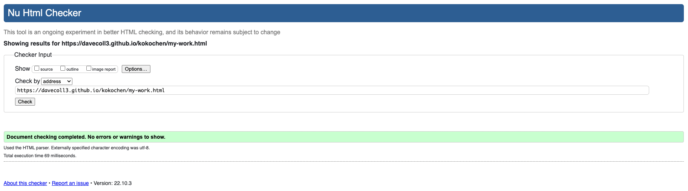
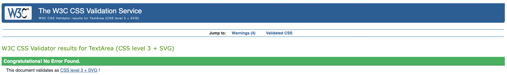
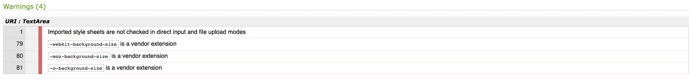

# Kokochen

Marien Wong Kwok Chuen is a freelance illustrator living in Metz, France. This portfolio site aims to showcase Marine's illustrations and examples of her work. The site will be targeted towards individuals and organisations who have a need for a talented freelance illustrator. It will clearly demonstrate a variety of original illustrations produced to date along with examples of illustrations used in previously commissioned work. The site will also be a useful means to contact Marine in order to commission new work.

The primary technologies used to form the basis of this website were the coding languages HTML5 and CSS3 which were complemented by use of the Bootstrap framework.

[View the live site here](https://davecoll3.github.io/kokochen/index.html)

&nbsp;

&nbsp;

# Table of Contents
  * [UX and UI](#ux-and-ui)
    * [Research](#research)
    * [Owner Goals](#owner-goals)
    * [User Stories](#user-stories)
    * [User Requirements and Expectations](#user-requirements-and-expectations)
    * [Design](#design)
    * [Wireframes](#wireframes)
  * [Features](#features)
    * [Existing Features](#existing-features)
    * [Features to be Implemented in the Future](#features-to-be-implemented-in-future)
  * [Technologies Used](#technologies-used)
    * [Languages](#languages)
    * [Frameworks and Libraries](#frameworks-and-libraries)
    * [Testing and Validation Tools](#testing-and-validation-tools)
  * [Testing](#testing)
    * [Manual Testing](#manual-testing)
    * [Browser Compatibility](#browser-compatibility)
    * [Bugs](#bugs)
  * [Validation](#validation)
    * [HTML](#html)
    * [CSS](#css)
    * [Color Contrast](#color-contrast)
  * [Deployment](#deployment)
  * [Credits](#credits)

&nbsp;

[//]: # (UX and UI section for discussing research and design)

# UX and UI

## Research

Research for the creation of this site was carried out by searching online for other freelance illustrators who have a portfolio website; links to the main sites used are linked below. These sites were examined with the end goal of extracting the key elements required for an illustrators portfolio site. From this examination, I established that information about the illustrator, examples of their work, links to their social media pages and a means of contacting them were common across all of these sites. The importance of using the illustrators images through the sites was also evident, maximising the exposure of their original works to the user.

* Illustrator #1: [Sophie Potter](https://www.sophiepotter.co.uk/)
* Illustrator #2: [Dave Bain](https://davebain.com/about)
* Illustrator #3: [Carys Tait](https://www.carys-ink.com/about)
* Illustrator #4: [Amy Jackson](https://www.ajillustration.co.uk/bio)
* Illustrator #5: [Jessica Smith](https://www.jessicasmithillustration.co.uk/)
* Illustrator #6: [Gemma Hastilow](https://gemmahastilow.co.uk/)

&nbsp;

## Owner Goals

  * Showcase illustrations and examples of previous work.
  * To generate interest in their work.
  * To receive new commissions.

&nbsp;

## User Stories

### First Time Visitor

  * As a first time user, I want to understand the main purpose of the site.
  * As a first time user, I want relevant content that informs about the owner and their work.
  * As a first time user, I want an easy means of contacting the site owner.

### Returning Visitor

  * As a returning user, I want to be easily able to locate and review images or information on the site.
  * As a returning user, I want to be able to quickly contact the site owner.
  * As a returning user, I want to be able to quickly access the site owner's social media links.

&nbsp;

## User Requirements and Expectations

### Requirements

  * Familiar and intuitive design that negates any learning curve.
  * A reactive site that is user friendly and well presented on all types of device and screen sizes.
  * An easy and logical means of navigation throughout the site on all devices.
  * Adequate levels of color contrast across the site that presents content in an accessible and easy to read manner.
  * An appealing presentation of the owner's original illustrations.
  * Links to the owner's social media sites and other material of interest.

### Expectations

  * Feedback when interacting with page links allowing me to easily know where I am on the site and where I can go to.
  * Feedback on the contact form to inform me when it has been completed and submitted correctly.
  * When clicking on social media links, they should open in a seperate tab or window.

&nbsp;

## Design

### Color Scheme

* Various shades of grey ( #708090, #545454, #d3d3d3, #3f3f3f) were used across the site (nav bar, footer, scroll to top button) alongside black and white for the textual content. These sombre colours were purposely chosen to give the site a clean modern look while allowing the vibrant colours of the various illustrations to pop on the screen; all while adhering to the WCAG 2.1 contrast guidelines.

### Fonts

* The Google font of Barlow was chosen as it closely resembles font used on other promotional work by the site owner. Barlow is a slightly rounded, low-contrast font which fits in with the clean modern look of the site.
  
### Imagery

* All images used across the site, including background images, are original creations of the site owner. The background images were used on the home page (callout banner) and contact me page (form) to provide a visually appealing backdrop to these pages, helping to highlight content contained within.

### Structure

* The information architecture type used for this site is the hierarchical tree structure. This common structure allows for simple navigation throughout the site and allows for easy expansion of the site in the future. The use of the burger navigation icon, along with a floating return to top button, help to overcome the common issues with this structure on mobile devices. 

Site Map

&nbsp;

## Wireframes

* Balsamiq Wireframes was used to create the wireframes for this site. 
Wireframes for mobile, tablet, and desktop can be found below:

  ### [Mobile Wireframe](/readme-files/wireframes/mobile-device.pdf)

  ### [Tablet Wireframe](/readme-files/wireframes/tablet.pdf)

  ### [Desktop Wireframe](/readme-files/wireframes/desktop.pdf)

&nbsp;

[Back to top &uarr;](#kokochen)

# Features 

## Existing Features

* Navigation Bar

  * Featured on all four pages, the full responsive navigation bar includes links to the Home, My Work, Gallery and Sign Up pages and is identical in each page to allow for easy navigation.
  * This section will allow the user to easily navigate from page to page across all devices without having to revert back to the previous page via the ‘back’ button. 
  * The user's current location is indicated by white text in the menu list items with the other items in a muted shade of grey; menu items are also highlighted when hovering over them, adding a responsive element.
  * The navigation menu will collapse into a burger icon on mobile screens allowing for a more user friendly and aesthetically pleasing experience.

    

* Callout Banner

  * The callout banner serves to introduce the user to the site owner with an eye catching avatar and background image used to grab their attention.  

    

* About Me Section

  * The about me section will further introduce the user to the site owner, informing them of their skills and education background. 

    

* The Footer

  * The footer section includes links to the relevant social media sites for the site owner; all links open to a new tab to allow easy navigation for the user.     * The footer is valuable to the user as it encourages them to keep connected via social media.
  * There is also copyright information contained in the footer to remind the user that the site's content is not licence free.

    

* The My Work Page

  * This page will allow the user to see some examples of the work already created by the site owner by describing and showcasing a varied selection of their work.

    

* Gallery

  * The gallery will provide the user with a variety of original illustrations created by the site owner.
  * This section is valuable to the user as they will be able to clearly see the various illustration styles used by the site owner. 

    

* Contact Me

  * The contact me page will provide a form for the user to submit a message in order to make enquiries or request a commission. 
  * The user will be asked to submit their name, email address, and a message describing their proposal. 

    

* Back to Top Button

  * A floating back to top button was used to allow the user an easy means of returning to the nav bar, this is especially important for mobile devices where the content is stretched vertically.

     

## Features to be Implemented in Future

  * Adding an isotope filter to the gallery page once I have a better understanding of JavaScript. This will allow users to more easily view illustrations that share a common theme or style.
  * Additionally, I would like to use JavaScript to better control the positioning of the back to top button; having it fade in as you scroll down the page.
  * An extra shop page that allows users to purchase items such as prints, cards and badges directly from the owner. 

&nbsp;

[Back to top &uarr;](#kokochen)

# Technologies Used

## Languages
  * [HTML5](https://en.wikipedia.org/wiki/HTML5)
  * [CSS3](https://en.wikipedia.org/wiki/CSS)

## Frameworks and Libraries

  * [Bootstrap](https://getbootstrap.com/docs/4.1/getting-started/introduction/)
    * Bootstrap v4.1.3 was used to help style and implement Java elements to the site, namely on the nav bar. 
  * [Font Awesome](https://fontawesome.com/)
    * The Font Awesome v6.1.2 library was used to supply the social media icons, on the site footer, and the chevron icon used for the back to top button.
  * [Google Fonts](https://fonts.google.com/)
    * Google Fonts was used to import the 'Barlow' font used throughout the site.

## Testing and Validation Tools
  * [W3C Markup Validation Service](https://validator.w3.org/#validate_by_input)
    * The W3C Markup Validation Service was used to check the markup validity of the html code. 
  * [W3C CSS Validation Service](https://jigsaw.w3.org/css-validator/#validate_by_uri)
    * The W3C CSS Validation Service was used to validate the css code. 
  * [a11y](https://color.a11y.com/)
    * The a11y Color Contrast Accessibility Validator was used to verify that the colour contrast across the site adhered to the WCAG 2.1 Guidelines.
  * [LambdaTest](https://www.lambdatest.com/)
    * LambdaTest was used to perform cross browser testing.

&nbsp;

[Back to top &uarr;](#kokochen)

# Testing 

## Manual Testing

Navigation Bar

  * The navigation bar is located at the top of the page and contains navigation links to all pages which are clearly visible in displays with a width of 576px or above. The user can easily identify which page they are on as it is highlighted in white text. The user is also provided with feedback when hovering over links to other pages as the text color changes to a lighter shade of grey when hovering over them.   
  * When the display width is 575px or below it collapses into a burger icon. All navigation links drop down when the burger icon is clicked and, again, the current page is highlighted in white text.
  * These elements are familiar and require little to no learning curve to use.

    

Callout Banner

  * The callout banner displays an avatar image of the site owner, their name, and their profession/service offered, in order to introduce the user to the owner and purpose of the site.
  * The background image used is an illustration of the site owner and fills the device viewport; it is reactive to all screen sizes and orientations while maintaining contrast levels with the heading text.

    

About Me Section

  * This section introduces the user to the site owner and is reactive to all screen sizes and orientations.

    

Footer

  * The footer is located at the bottom of the page and contains social media links and copyright information, it is reactive to all screen sizes and orientations.
  * The icons for each social media link provide feedback to the user upon hover over as they change to a different shade of grey.
  * Each of the social media links opens in a new page as per best practice and to ensure a good user experience.

    

My Work Page

  * The My Work page displays works created by the page owner and contains text and images all of which are reactive to all screen sizes and orientations.
  * The images are displayed in a row on larger devices and drop down onto a second line when the viewport width is 1199px or smaller. When the viewport width is smaller than 770px the images display in single file one on top of the other.

      
  

Gallery

  * The gallery images are displayed in rows of three on larger devices and change to rows of two when the viewport width is 1199px or smaller. When the viewport width is smaller than 770px the images display in single file one on top of the other.

      
  

Contact Me

  * The contact me page allows the user to contact the site owner and is reactive to all screen sizes and orientations.
  * All inputs on the form, contained on the contact me page, must be completed in order to be submitted; this includes a valid email address being input in the email field.
  * The submit button icons provide feedback to users upon hover over as it changes to a different shade of grey.

      
  

Back To Top Button

  * As the navbar is not fixed, a back to top button was added to allow the user to easily return to the navigation links at any stage. This is particularly useful on mobile devices, particularly on the My Work and Gallery pages, as it avoids the need for excessive scrolling.

      
  

&nbsp;

## Browser Compatibility

[LambdaTest](https://www.lambdatest.com/) was used to test the site across a number of browsers, including:

  * Chrome
  * Safari
  * Edge
  * Firefox
  * Opera

&nbsp;

## Bugs

### Navar/Hamburger Menu
  During testing of the navigation bar, it was noted that while the navigation menu collapsed into a hamburger menu, on mobile devices, it was not displaying the drop-down menu upon clicking. After much troubleshooting it was discovered that the lack of bootstrap JavaScript links was the cause of this issue. Once the requisite links were included, the hamburger drop-down menu responded as expected.

### Callout Avatar/Headings
  When positioning the avatar image and headings within the callout banner, the contrast with the background image was taken into consideration; as when the bottom of the image overlaps with the heading, it causes contrast issues. Additionally, the background image was set to occupy the entire viewport. The positioning was initially set using absolute units, however, during testing it was noted that when a mobile device was changed from portrait to landscape orientation, it caused an overlap and made the headings difficult to read. After much trial and error, the relative units vh, vmin and vmax were used allowing the avatar image and headings to be responsive to all viewport sizes and orientations while maintaining good contrast with the background image.

### Footer Social Media Links
  When testing the social media links in the footer, it was noted that small black dots were appearing between the social media icons upon hover over. After unsuccessfully troubleshooting this problem, a post was placed on the slack project-milestone-1 page where user jo_ci highlighted that it was being caused by the < a > element. This element was targeted with text-decoration: none; which resolved the issue. 

&nbsp;

[Back to top &uarr;](#kokochen)

# Validation

## HTML
The [W3C Markup Validation Service](https://validator.w3.org/#validate_by_input) was used to validate the code.
All pages were successfully validated with no errors or warnings.

Home

My Work

Gallery

Contact Me

&nbsp;

## CSS
The [W3C CSS Validation Service](https://jigsaw.w3.org/css-validator/#validate_by_uri) was used to validate the code.
No errors were found but four warnings were highlighted; as these related to the imported google fonts stylesheet and prefixes relating to different browsers, they are not of concern.

CSS Validation

CSS Warnings

&nbsp;

## Color Contrast
The color contrast accessibility validator [a11y](https://color.a11y.com/) was used to verify that the colour contrast across the site adhered to the WCAG 2.1 Guidelines.

Homepage

My Work Page

Gallery Page

Contact Me Page

&nbsp;

[Back to top &uarr;](#kokochen)

# Deployment

The site was deployed to GitHub pages. The steps to deploy are as follows:
  1. Log in to GitHub and locate the repository: [kokochen](https://github.com/davecoll3/kokochen).
  2. Once in the repository, navigate to the Settings tab at the top of the page.
  3. On the settings page, locate the Pages option on the left hand menu.
  4. Under the Build and deployment heading, navigate to the "Deploy from a branch" dropdown menu under the subheading Source; select master.
  5. Save your changes.
  6. After a few minutes, return to/refresh this page and a link will now be supplied at the top of the Pages section. 

The live link can be found [here](https://davecoll3.github.io/kokochen/index.html)

&nbsp;

## Forking a GitHub Repository
  1. Log in to GitHub and locate the repository: [kokochen](https://github.com/davecoll3/kokochen).
  2. Once in the repository, navigate to the Fork button at the top right of the page.
  3. Save your forked repository.

&nbsp;

[Back to top &uarr;](#kokochen)

# Credits 

## Content 

  * The icons in the footer and back to top button were taken from [Font Awesome](https://fontawesome.com/)
  * The Code Institute readme-template provided the basic structure for the readme.md file.

&nbsp;

## Media

  * All of the images used across the site are original creations of Marine Wong Kwok Chuen and were used with her permission.

&nbsp;

## Code

  * The CSS code for the gallery was taken from the LogRocket article [How to create a responsive image gallery with CSS flexbox](https://blog.logrocket.com/how-create-responsive-image-gallery-css-flexbox/) and is fully credited in the stylesheet.

  &nbsp;

  [Back to top &uarr;](#kokochen)